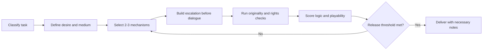

<div align="center">
  

  <h1>Stephen Chow.skill</h1>

  <p><strong>Turn “make it wulitou” from a vague style request into an executable, testable comedy workflow.</strong></p>

  <p><a href="README.md">简体中文</a> · <a href="README.en.md">English</a></p>

  <p>
    
    
    <a href="https://github.com/chnjames/stephen-chow-skill/actions/workflows/validate.yml"></a>
    
  </p>
</div>

> [!IMPORTANT]
> This is an independent tool for researching Stephen Chow films and Chinese-language absurdist comedy mechanisms. It is not a digital replica and is not affiliated with, authorized by, or endorsed by Stephen Chow or any rightsholder.

## The Problem It Solves

Ask a general model to “write like Stephen Chow” and it will often stack catchphrases, produce disconnected randomness, or echo familiar scenes.

This skill takes a different route. It models character desire, status, governing rules, escalation, reversal, and emotional return before generating original expression.

It is not a quote imitator. It acts as a **comedy writer, script doctor, and originality gate**.

## What You Can Build

| Use case | Example request |
|---|---|
| Short video | “Turn this idea into an original 60-second comedy with a visual contradiction in the first three seconds.” |
| Script diagnosis | “Explain why this scene is not funny, then provide a minimal repair and a bold rewrite.” |
| Advertising | “Create character-led, situation-led, and visual-object-led concepts.” |
| Character design | “Design an original low-status, high-dignity protagonist with coherent behavior.” |
| Film research | “Analyze status inversion in Kung Fu Hustle, separating facts from formal interpretation.” |
| Collision review | “Keep the creative goal while replacing expression that resembles an existing film.” |

## Quick Example

```text
Use $stephen-chow-skill to turn “an intern impersonates the CEO at the company gala”
into a one-minute video. Do not use existing characters, dialogue, or recognizable scenes.
```

Before drafting, the skill establishes:

- the protagonist's sincere want;
- a legible social rule;
- two or three compatible comedy mechanisms;
- a causal escalation chain;
- an emotional return;
- an originality and rights check.

It then produces a playable beat sheet, dialogue, and performance notes. See [examples/sample-workflow.md](examples/sample-workflow.md) for a complete sample.

## More Than A Prompt

The repository contains maintainable creative infrastructure:

- **8 core comedy mechanisms**;
- **5 request routes**: research, diagnosis, original creation, transformation, and identity/asset review;
- **4 medium workflows**: short video, sketch, advertising, and long-form development;
- **3 guard scripts** for sources, textual overlap, and output preflight;
- **5 regression tests**;
- **1 GitHub Actions validation workflow**.

## Installation

Windows PowerShell:

```powershell
git clone https://github.com/chnjames/stephen-chow-skill.git "$HOME\.codex\skills\stephen-chow-skill"
```

macOS / Linux:

```bash
git clone https://github.com/chnjames/stephen-chow-skill.git "$HOME/.codex/skills/stephen-chow-skill"
```

Restart Codex or start a new session, then invoke:

```text
Use $stephen-chow-skill to diagnose this comedy idea and produce three original directions.
```

Install the complete repository, not only `SKILL.md`; the workflow also uses `references/`, `scripts/`, and `agents/`.

## Workflow



The skill refuses to confuse randomness with absurdist comedy. Each escalation must follow a character choice, and every reversal must change status, cost, or audience understanding.

## Rights Boundary

Supported:

- sourced film research and formal analysis;
- high-level mechanisms rather than protected expression;
- original characters, worlds, plots, dialogue, and endings;
- transformation of user-owned or authorized material;
- source, originality, and risk checks before publication.

Not supported:

- impersonation or false claims of participation, authorization, appearance, or endorsement;
- unauthorized cloning of a natural person's face, voice, signature, or identity;
- full scripts, subtitles, lengthy dialogue, songs, or substitutes for recognizable scenes;
- unauthorized continuations, character reuse, or near-remakes;
- removal of legally or contractually required AI labels.

The repository includes no films, subtitle corpora, scripts, images, voice samples, or biometric datasets.

## Local Validation

Python 3.11+ is recommended. The scripts use only the standard library.

```powershell
python tests\validate_skill.py
python scripts\source_validator.py references\source-registry.json
python -m unittest discover -s tests -v
```

Generate an output scorecard:

```powershell
python scripts\evaluate_output.py --input output.txt --mode script
```

Check against lawfully obtained operator-supplied reference text:

```powershell
python scripts\quote_guard.py `
  --candidate output.txt `
  --references rights-holder-material.txt
```

`quote_guard.py` is a human-review heuristic, not a legal determination.

## Roadmap

- [ ] More anonymized short-video, advertising, and sketch evaluations
- [ ] Source-expiration reminders and link checks
- [ ] Configurable originality thresholds
- [ ] Multi-model output benchmarks
- [ ] Rightsholder-owned private libraries with valid authorization

## Contributing And Stars

Contributions to general comedy mechanisms, source corrections, tests, and real-world evaluations are welcome. Do not submit unauthorized dialogue, subtitles, scripts, images, audio, or video.

If this skill helps an AI produce less awkward imitation and more structurally sound original comedy, consider starring the repository so other creators can find it.

## License

Code and original documentation are available under the [MIT License](LICENSE). This license grants no rights to third-party names, likenesses, voices, trademarks, films, characters, scripts, dialogue, music, or other protected material.

This project provides creative workflows and technical safeguards, not legal advice.
