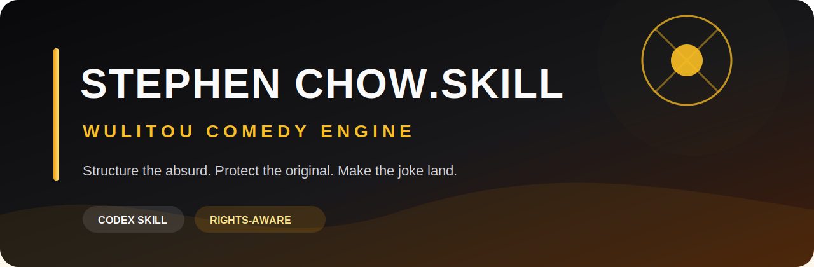
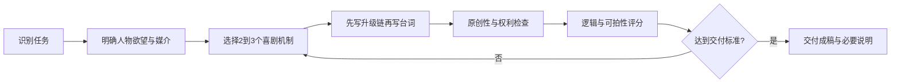

<div align="center">
  

  <h1>周星驰.skill</h1>

  <p><strong>把“无厘头”从一句风格要求，变成一套可以执行、检查和迭代的喜剧创作流程。</strong></p>

  <p>
    <a href="README.md">简体中文</a> ·
    <a href="README.en.md">English</a>
  </p>

  <p>
    
    
    <a href="https://github.com/chnjames/stephen-chow-skill/actions/workflows/validate.yml"></a>
    
  </p>
</div>

> [!IMPORTANT]
> 这是一个研究周星驰电影与华语无厘头喜剧机制的**独立创作工具**，不是周星驰数字分身，也不代表本人或任何影视权利方。

## 它解决什么问题？

你对 AI 说“写得像周星驰一点”，通常会得到三种东西：堆砌口头禅、随机发疯、复制似曾相识的桥段。

`周星驰.skill` 走的是另一条路：先拆解人物欲望、地位关系、规则冲突、升级链和情感回收，再生成原创表达。

```text
普通提示词：写一个无厘头的餐厅段子。

使用本 Skill：
1. 找到角色真正想保住的东西：面子、工作，还是爱情；
2. 建立观众能看懂的餐厅规则；
3. 用地位反转与带变化的重复逐级加码；
4. 让每次失控都来自角色上一刻的选择；
5. 用前面出现的道具完成笑点与情感双重回收；
6. 检查是否复刻了已有台词、人物或场景。
```

它不是“台词模仿器”，而是一套**喜剧编剧 + 剧本医生 + 原创性守门员**。

## 你可以拿它做什么？

| 场景 | 你可以这样问 |
|---|---|
| 短视频 | “把这个点子改成60秒原创荒诞喜剧，前三秒必须有视觉冲突。” |
| 剧本诊断 | “为什么这场戏不好笑？先诊断，再给最小修改版和大胆重构版。” |
| 广告创意 | “给我人物驱动、情境驱动、道具驱动三个完全不同的方向。” |
| 人物设计 | “设计一个低地位、高自尊、行动逻辑自洽的原创喜剧主角。” |
| 电影研究 | “分析《功夫》的地位反转，区分事实、评论与形式分析并附来源。” |
| 创意避撞 | “保留这个创意目标，但替换掉容易让人联想到现有电影的表达。” |

## 一眼看懂效果

### 输入

```text
使用 $stephen-chow-skill，把“实习生在公司年会上冒充老板”写成一分钟短视频。
不要使用任何电影角色、台词或经典桥段。
```

### 它不会直接开写

它会先建立：

- **人物欲望**：实习生只想替同事争取被取消的餐补；
- **喜剧规则**：所有人只能用管理黑话发言；
- **主机制**：错误身份 + 地位反转；
- **升级链**：被请上台 → 被要求裁员 → 真老板开始记笔记；
- **情感回收**：他最后承认身份，却第一次把真实问题说出口；
- **原创性检查**：独立人物、公司规则、道具、对白和结局。

然后才产出可拍摄的节拍表、对白和表演提示。完整样例见 [examples/sample-workflow.md](examples/sample-workflow.md)。

## 为什么不是一段 Prompt？

这个仓库把创作流程拆成了可维护的工程资产：

- **8 类核心喜剧机制**：人物发动机、规则冲突、地位反转、类型错置、重复升级、延迟后果、道具回收、情感反冲；
- **5 类创作路由**：研究、诊断、原创、改写、身份与素材风险审查；
- **4 套媒介工作流**：短视频、短场景、广告、长篇或系列开发；
- **3 个守卫脚本**：来源登记、文本近似检查、输出预检；
- **5 项回归测试**：覆盖来源格式、文本碰撞与身份冒充风险；
- **1 条 GitHub Actions 流水线**：每次推送自动验证。

核心指令保持精简，详细方法论按任务从 `references/` 加载，不会每次都把整套资料塞进上下文。

## 安装

### Codex

Windows PowerShell：

```powershell
git clone https://github.com/chnjames/stephen-chow-skill.git "$HOME\.codex\skills\stephen-chow-skill"
```

macOS / Linux：

```bash
git clone https://github.com/chnjames/stephen-chow-skill.git "$HOME/.codex/skills/stephen-chow-skill"
```

安装后重启 Codex 或开始一个新会话，然后输入：

```text
使用 $stephen-chow-skill 诊断这个喜剧点子，并给出三个原创方向。
```

> 请复制完整仓库，不要只复制 `SKILL.md`。运行时还需要 `references/`、`scripts/` 和 `agents/`。

## 它是怎么工作的？



它拒绝把“随机”当作“无厘头”。每次升级必须来自角色选择，每个反转必须改变地位、代价或观众理解。

## 原创与权利边界

### 支持

- 有来源的电影研究与形式分析；
- 抽象喜剧机制，不复刻具体表达；
- 独立人物、世界、情节、对白和结局；
- 改写用户拥有权利或已获授权的材料；
- 发布前的来源、原创性和风险检查。

### 不支持

- 冒充周星驰本人或暗示其参与、授权、认可、出演或代言；
- 未经授权克隆任何自然人的脸、声音、签名或身份；
- 输出完整剧本、字幕、大段台词、歌曲或可替代原作的场景；
- 未经授权续写角色、故事宇宙或制作近似翻拍；
- 帮助移除法律或平台要求的 AI 标识。

仓库不收录电影、字幕语料、剧本、图片、声音样本或生物识别数据集。

## 仓库结构

```text
stephen-chow-skill/
|-- SKILL.md                         # 核心工作流
|-- agents/openai.yaml              # Codex 展示信息
|-- references/                     # 方法论、来源、评测和安全边界
|-- scripts/                        # 来源、近似文本与输出检查
|-- examples/sample-workflow.md     # 完整创作样例
|-- tests/                          # 结构和行为测试
`-- .github/workflows/validate.yml  # 自动验证
```

## 本地验证

脚本仅使用 Python 标准库，建议 Python 3.11+。

```powershell
python tests\validate_skill.py
python scripts\source_validator.py references\source-registry.json
python -m unittest discover -s tests -v
```

生成输出评分表：

```powershell
python scripts\evaluate_output.py --input output.txt --mode script
```

使用操作者合法获得的参考文本检查潜在近似表达：

```powershell
python scripts\quote_guard.py `
  --candidate output.txt `
  --references rights-holder-material.txt
```

`quote_guard.py` 是人工审核辅助工具，不提供侵权与否的法律结论。

## 路线图

- [ ] 增加更多短视频、广告和短剧匿名评测样例
- [ ] 增加来源过期提醒与链接状态检查
- [ ] 提供可配置的原创性审核阈值
- [ ] 增加多模型输出对比基准
- [ ] 在合法授权下支持权利方自有资料库

## 贡献与 Star

欢迎提交通用喜剧机制、来源修正、测试和真实使用反馈。不要提交未经授权的台词、字幕、剧本、图片、音频或视频。

如果它让 AI 少写了一段“尴尬模仿”，多写出了一场真正成立的喜剧，欢迎点一个 Star，让更多创作者找到它。

## 许可证

本仓库代码与原创文档使用 [MIT License](LICENSE)。许可证不授予任何第三方姓名、肖像、声音、商标、电影、角色、剧本、对白、音乐或其他受保护材料的权利。

本项目提供创作工作流和技术辅助，不构成法律意见。
